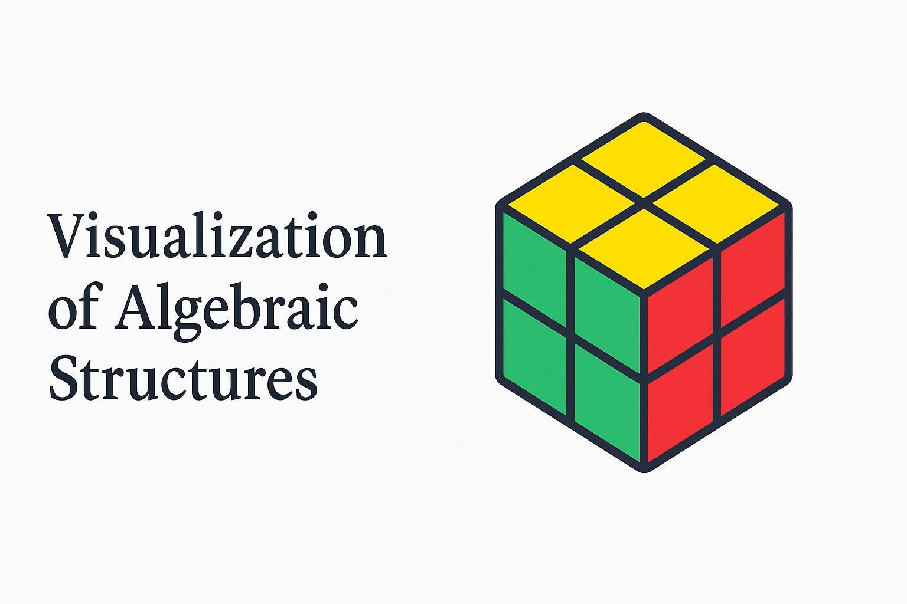

[](LICENSE)
<a href="https://funnyalgebraicvisualizations.github.io/" target="_blank">
  
</a>


# Funny Algebraic Visualizations

<a href="https://funnyalgebraicvisualizations.github.io/" target="_blank">
  🌐 Visit the Website
</a>


 <!-- **Live site:** https://funnyalgebraicvisualizations.github.io/ -->

Interactive **visualizations of algebraic structures** with a clean, academic design.  
Current focus: **Group Theory** — Cayley graphs of $S_4$ and its subgroups $A_4$, $C_4$, $D_4$.  
Future directions: **Lie algebras**, **Young tableaux**, and spectral/representation views.

> Goal: Build a unified space where algebraic structures can be explored visually, interactively, and reproducibly.

---

## Features
- 🧭 **Interactive visualizations** (Plotly exports embedded in viewer)
- 🧾 **LaTeX notes** rendered with MathJax
- 🌓 **Light/Dark theme** with icon toggle
- 🧱 **WebGL fallback** — graceful message on unsupported devices
- 📦 Hosted via **GitHub Pages**, no backend required

---

## Project Structure
```text
.
├─ index.html                 # Main site shell
├─ assets/                    # Favicon, og-preview image, icons
├─ graphs/                    # Prebuilt visualizations (Plotly HTML exports)
│  ├─ cayley_graph_S4_gs_1.html
│  ├─ cayley_graph_S4_gs_2.html
│  ├─ cayley_graph_S4_A4.html
│  ├─ cayley_graph_S4_C4.html
│  └─ cayley_graph_S4_D4.html
├─ README.md
└─ LICENSE
```

---

## Generate Visuals
```python
import plotly.graph_objects as go, plotly.io as pio

fig = go.Figure(data=[ ... ], layout=go.Layout(margin=dict(l=0,r=0,t=0,b=0)))
pio.write_html(fig, "graphs/my_visual.html", include_plotlyjs="cdn", full_html=True)
```
Then reference it in `index.html` via the viewer iframe or add a new Quick Access card.

---

## Local Preview
```bash
python -m http.server 8000
# open http://localhost:8000/
```

---

## License
Released under the **MIT License** (see [LICENSE](LICENSE)).

© 2025 funnyalgebraicvisualizations
